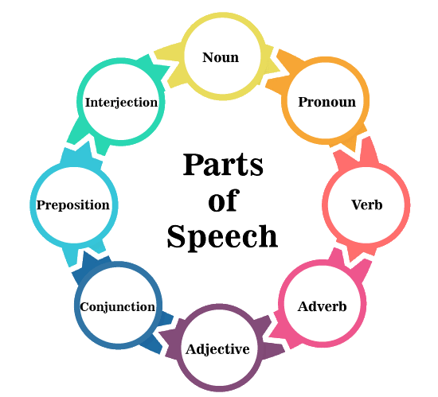

<br />
<div align="center">
  
  <h3 align="center">Part of Speech Quiz App</h3>
</div>

<details>
  <summary>Table of Contents</summary>
  <ol>
    <li>
      <a href="#about-the-project">About The Project</a>
      <ul>
        <li><a href="#built-with">Built With</a></li>
      </ul>
    </li>
    <li>
      <a href="#getting-started">Getting Started</a>
      <ul>
        <li><a href="#prerequisites">Prerequisites</a></li>
        <li><a href="#installation">Installation</a></li>
      </ul>
    </li>
    <li><a href="#usage">Usage</a></li>
    <li><a href="#contact">Contact</a></li>
  </ol>
</details>


<!-- ABOUT THE PROJECT -->
## About The Project


Part of Speech Quiz Web App is to provide an engaging and educational platform for users to test and improve their understanding of various parts of speech in the English language. The web app will present users with a series of quiz questions, where they will be required to identify the correct part of speech (noun, verb, adjective, adverb, etc.) for a given word. The addition of a timer feature will create a sense of urgency, encouraging users to respond quickly and test their knowledge under time constraints. By offering an interactive and time-bound experience, the web app aims to enhance users' grammar skills, reinforce their understanding of parts of speech, and promote a challenging yet fun learning environment.


### Built With

List of all frameworks/libraries used to bootstrap the App.

* [![React][React.js]][React-url]
* [![Node.js][Node.com]](Node-url)


<!-- GETTING STARTED -->
## Getting Started

To get a local copy up and running follow these simple example steps.

### Prerequisites

* [Node](https://nodejs.org/en)

### Installation


1. Clone the repo
   
   ```sh
   git clone https://github.com/SamyIsaac1/Part-of-Speech-Quiz-App.git
   ```


2. cd ./backend then Add .env file
   ```js
   PORT=5000
   ```
3. open cmd ( npm run dev for Build and start the backend )
   ```sh
   npm install
   npm run dev  
   ``` 

4. cd ./frontend then Add .env file
   ```js
   REACT_APP_BASE_URL="http://localhost:5000"
   ```

5. open cmd  
   ```sh
   npm install
   npm start
   ```

6. Testing the backend cd ./back-end open cmd  
   ```sh
   npm run test
   ```
<div align="center">
  
</div>

List of 3rd Parties.
```sh
// backend
// dependencies
cors
express
dotenv

// devdependencies for development and testing
@types/cors
@types/express
@types/jasmine
@types/node
@types/supertest
concurrently
jasmine
jasmine-spec-reporter
nodemon
supertest
typescript


// frontend
axios
react
react-dom
react-router-dom
react-scripts
font-awesome
sweetalert2
```


<!-- USAGE EXAMPLES -->
## Usage
Once the server is running, you can access Task App by opening your web browser and navigating to http://localhost:3000

- Start Practicing  


- Practice page where you solve qustions, watch out the Timer !!!


- Rank Page to know your rank among others


- you'll find not Found page if you accidently lost 

<!-- ROADMAP -->
## Development Process


**Project Setup**: Started by setting up my development environment. Installed the necessary tools and frameworks such as Node.js and any additional libraries or dependencies required for my web app.

**Planning and Requirements Gathering**: Clearly defined the purpose, goals, and target audience of my web app. created a comprehensive plan.


**Backend-first Approach**:
As A full- stack I prefer Backend-first Approach because In this approach I can focus on developing and implementing the server-side logic, APIs, and database structure before working on the user interface and frontend components. This approach allows for the backend functionality to be thoroughly tested and validated before integrating it with the frontend

**Backend Development Process**: 
- Setup Express app 
- Implement Routes,and Controllers
- Handle Not Found Route
- Add Validations
- Handle Errors and Exceptions 


**Frontend Development Process**:
- Start search to find an inspiring design 
- Implement using html and css.
- convert it to react components


- Start Page
    - Has a start button to start practing.
- Add features to Pratice page
    - Timer to switch to the next question.
    - Prograss Bar  
- Add Not Found Page
- Handle Errors and Exceptions


<!-- CONTACT -->
## Contact

Samy Isaac - samyIsaack7@gmail.com - [LinkendIn](https://www.linkedin.com/in/samy-isaac/) 


Project Link: [https://github.com/SamyIsaac1/Part-of-Speech-Quiz-App.git](https://github.com/SamyIsaac1/Part-of-Speech-Quiz-App.git)

<!-- Icons -->
[React.js]: https://img.shields.io/badge/React-20232A?style=for-the-badge&logo=react&logoColor=61DAFB
[React-url]: https://reactjs.org/
[Node.com]:https://img.shields.io/badge/Node.js-18.x-green?style=for-the-badge&logo=node.js&logoColor=white
[Node-url]: https://nodejs.org/ 
